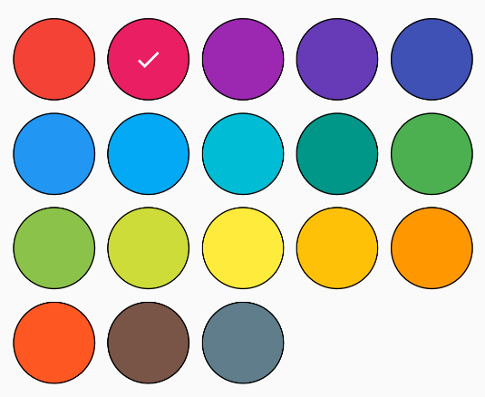
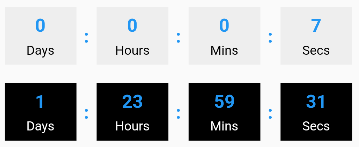
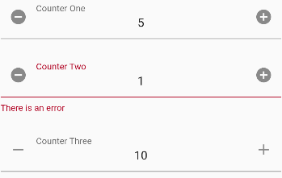
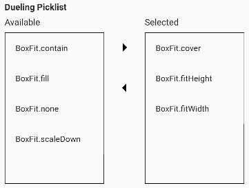
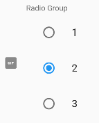
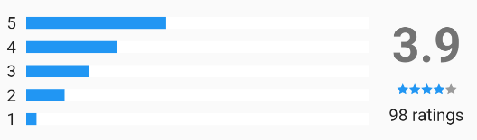

# Flutter Widgetz

A set of [Flutter](https://flutter.dev) widgets I use in various projects.

## Features

- Accordion
- Alert
- AppBar
- AuthButton
- Autocomplete
- Avatar
- AvatarGroup
- Badge
- BottomAppBar
- BottomNavigationBar
- Button
- Carousel
- CheckboxField
- CheckboxGroup
- ColorField
- ColorPicker
- Countdown
- CounterField
- DateField
- DateRangeField
- DirectionalPad
- Divider
- Drawer
- DropdownField
- DuelingPicklist
- DurationField
- DurationPicker
- ElevatedButton
- FeedbackBar
- FloatingActionButton
- Image
- InputDecorator
- LayoutBuilder
- Link
- ListTile
- NavigationRail
- OrientationBuilder
- PercentIndicator
- Placeholder
- Poll
- PopupMenuItem
- ProgressIndicator
- RadioGroup
- RatingBar
- RatingSummary
- ReorderableListView
- SaveButton
- Scaffold
- SearchBar
- Settings
- Shimmer
- SimpleDialogOption
- SingleChildScrollView
- Slider
- SliverGrid
- SliverList
- SpacedColumn
- SpacedRow
- TabBar
- TextField
- TimeField

## Additional information

The [generated documentation](https://pub.dev/documentation/flutter_widgetz/latest) has a great overview of all that is available.

## Screenshots

### Accordion

### Alert

### Auth Button

### Checkbox Group

### Color Picker

### Countdown

### Counter Input

### Directional Pad

### Divider

### Dueling Picklist

### Duration Picker

### Feedback Bar

### Percent Indicator

### Poll

### Radio Group

### Rating Bar

### Rating Summary

### Settings

### Shimmer

### Slider

